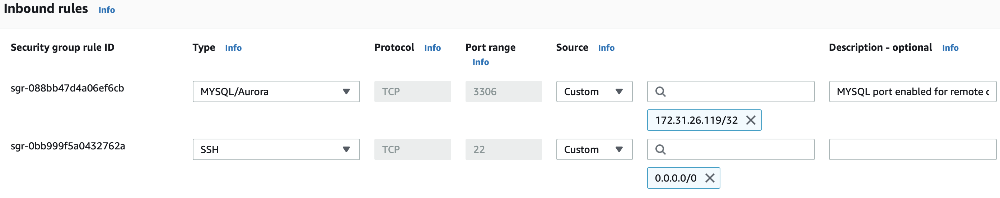
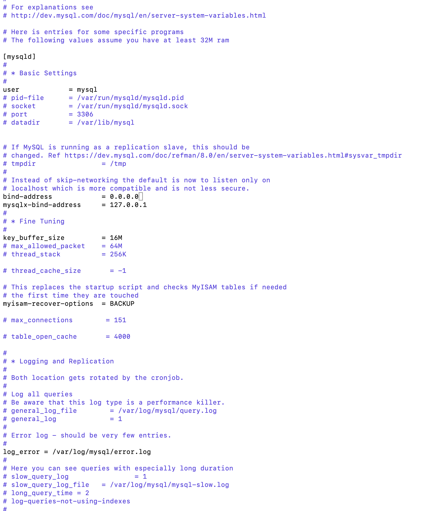
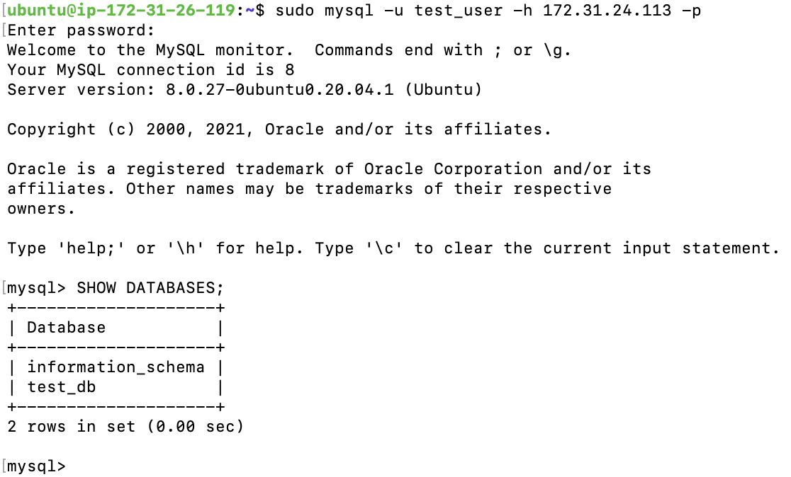

Firstly, I configured 2 free tier Ubuntu 20.04 EC2 instances in AWS. One as client and the other as Server.

Server 1 = Client
Server 2 = Server

On **Server** I ran the `sudo apt update` and `sudo apt upgrade`

Then installed MYSQL server `sudo apt install mysql-server` and enabled MYSQL service `sudo systemctl enable mysql`

On the **client** I ran the `sudo apt update` and `sudo apt upgrade` and installed mysql-client using the command `sudo apt install mysql-client`

Then enabled port 3306 on the Server in security inbound rules to allow inbound communications. As a security measure, I only permitted access to the client IP.

Next I ran a security script to secure my server

`sudo mysql_secure_installation`

Next, logged into database `sudo mysql` and created a db user to remotely access mysqlDB (Server)

Created a database named test_db

Next granted remote user created (test_user) privileges to the database

Finally, flush privilege to enable changes to take effect without reloading or restarting mysql service. 

Configured MySQL to allow connection from remote hosts by running the command below to change the bind-address from 127.0.0.1 to 0.0.0.0 in the configuration file. This will enable user (test_user) to connect to MySQL server from any IP.

`sudo vi /etc/mysql/mysql.conf.d/mysqld.cnf`

Restared MySQL services with `sudo systemctl restart mysql`

## Testing Connection from Client 

connected remotely from mysql client to mysqly server using the command structure ***mysql -h [mySQLServer IP] -u test -p***

`sudo mysql -u test_user -h 172.31.24.113 -p`

